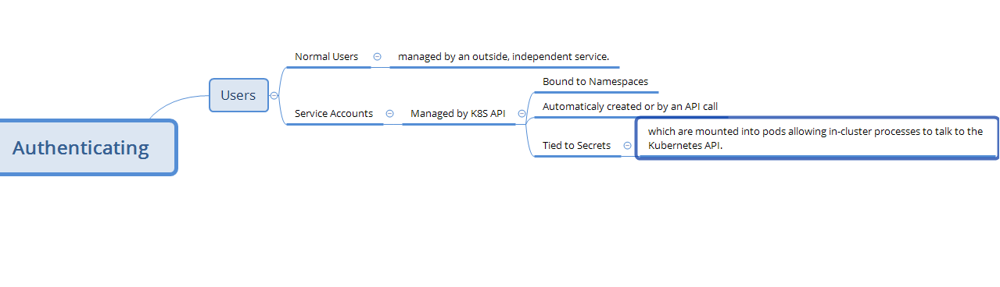

## This page provides an overview of authenticating.
[refer here for Original Documentation](https://kubernetes.io/docs/reference/access-authn-authz/authentication/)
* __Users in Kubernetes__
* __Authentication strategies__
* __Anonymous requests__
* __User impersonation__
* __client-go credential plugins__

#### Users in Kubernetes

* All Kubernetes clusters have two categories of users:
    1. service accounts managed by Kubernetes
    2. normal users.
    

#### Authentication strategies

* Kubernetes uses client certificates, bearer tokens, an authenticating proxy, or HTTP basic auth to authenticate API requests through authentication plugins.
* when requests are made to API server,
    * Username: a string which identifies the end user. Common values might be __kube-admin__ or __jane@example.com__
    * UID: a string which identifies the end user and attempts to be more consistent and unique than username.
    * Groups: a set of strings which associate users with a set of commonly grouped users.
    * Extra fields: a map of strings to list of strings which holds additional information authorizers may find useful.

* You can enable multiple authentication methods at once. You should usually use at least two methods:

    * service account tokens for service accounts
    * at least one other method for user authentication.
    