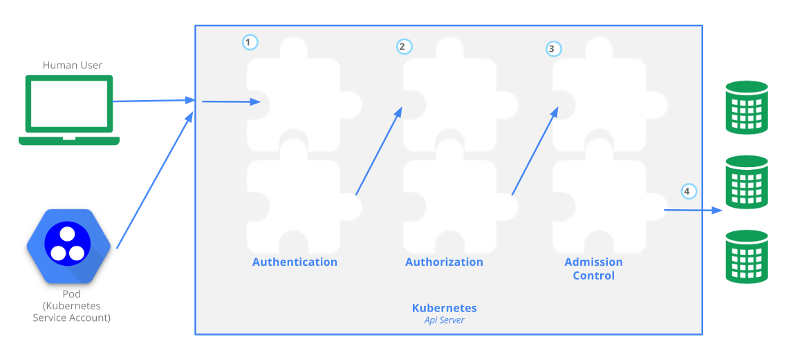

## Controlling Access to the Kubernetes API
* Note: __K8S__ ==> __Kubernetes__ 
* Users access the API using kubectl, client libraries, or by making REST requests. Both human users and Kubernetes service accounts can be authorized for API access. When a request reaches the API, it goes through several stages, illustrated in the following diagram:
* 

    [refer here for Kubernetes Documentation](https://kubernetes.io/docs/reference/access-authn-authz/controlling-access/)

#### Transport Security

* In a __K8S__ cluster, 
    * API serves on port 443
    * All the requests are of REST or Client Libraries. i.e __HTTPS__ based requests and it needs a __SSL__ Certificate.
    * That Certificate will be created whenever a K8S cluster is created at *$USER/.kube/config* and self-signed. (Note: If it is a __SINGLE__ user only)
    * For multiple users, then creator needs to share the Certificate with others.

#### Authentication

* Once TLS is established,
    * The HTTP request moves to Authentication step.
    * cluster admin configures the API server to run one or more Authenticator Modules. Authenticators are described in more detail [here](https://kubernetes.io/docs/reference/access-authn-authz/authentication/).
    * Authentication modules include Client Certificates, Password, and Plain Tokens, Bootstrap Tokens, and JWT Tokens (used for service accounts).
    * Multiple authentication modules can be specified, in which case each one is tried in sequence, until one of them succeeds.
    * If the request cannot be authenticated, it is rejected with HTTP status code 401.
        * Otherwise, the user is authenticated as a specific username, and the user name is available to subsequent steps to use in their decisions. Some authenticators also provide the group memberships of the user, while other authenticators do not.

#### Authorization

    * After authentication the request must be Authorized
        * A request must include the
            * username of the requester.
            * the requested action. and 
            * the object affected by the action.
        * The request is authorized if an existing policy declares that the user has permissions to complete the requested action.

    '''
    For example, if Bob has the policy below, then he can read pods only in the namespace projectCaribou:

    {
        "apiVersion": "abac.authorization.kubernetes.io/v1beta1",
        "kind": "Policy",
        "spec": {
            "user": "bob",
            "namespace": "projectCaribou",
            "resource": "pods",
            "readonly": true
        }
    }
    '''